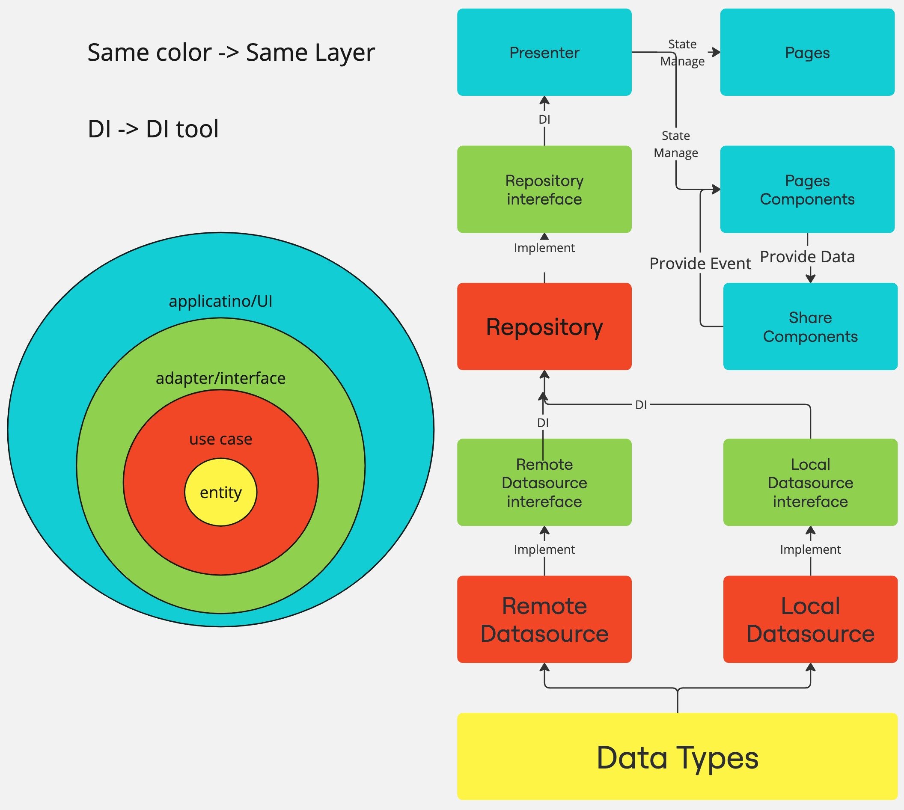

# インストール方法

1. ".envsample"を.envに変更
2. npm install
```
 npm i
```
3. 開発版実行 (任意)
```
npm run dev
```
4. 単体テスト (任意)
```
npm run unit-test
```
5. Storybook	(任意)
```
npm run storybook
```

# 環境

 - node : v22.8.0
 - npm : 10.8.2
 - nuxt

# ファイル構成&説明

 - components //UI
	- share //共有のcomponents
	- form //pages対応のcomponents
- src //ビジネスロジック
	- app //pages対応
	- share //共有のservice
- test //単体テスト

# アーキテクチャー


# 実装かかる時間
1/11 (土)　
環境設定: dotenv, eslint, vuetify, storybook, tailwindcss,...などなど
1/12 (日)　
API〜アーキテクチャーを実装します。
API Service, クリーンアーキテクチャー (Data, Domain, Presenter)
1/13 (月)
UIを実装します。Presenterを調整します。
1/14 (火)
READMEを作ります。

# 開発について

 - クリーンアーキテクチャー
 - DI: pinia
 - 状態管理: pinia
 - 単体テスト(Mock): vitest
 - UI: vuetify + tailwindcss
 - API: axios
 - 環境管理:dotenv
 - データ検証:zod
 - lint: Eslint

# 環境設定
- [x] dotenv
- [x] eslint + prettier
- [x] storybook
- [x] unit test
- [x] ci -> git actions
# リストの改善
- [ ] make date input get better

- [ ] presenter unit test

- [ ] make component for storybook (storybook cannot handle v-model component) / search way to do it